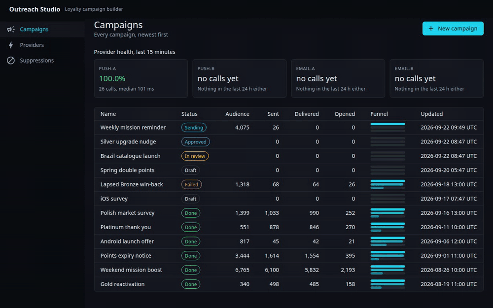
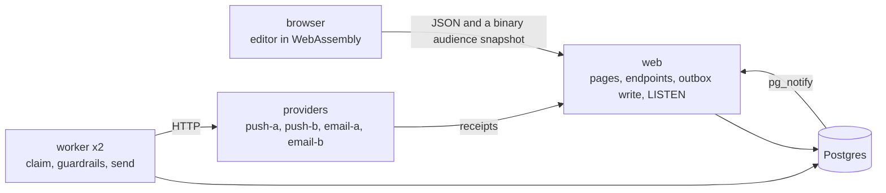
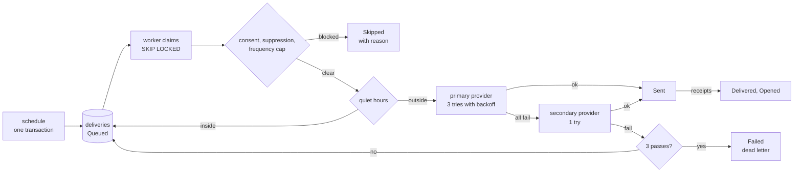

# outreach-studio

A campaign builder for a loyalty and rewards product, built to show what a Blazor Web App on .NET 10 looks like when the hard parts are done properly: the audience rule engine runs in the browser and on the server from one assembly, sends go through a transactional outbox that is exactly-once per user per channel under concurrent workers, guardrails run at send time, providers fail over, and every delivery is one trace in the Aspire dashboard.

No hosted demo, no AI feature, no real provider. Postgres, two workers and four mock providers come up with one `dotnet run`.

## Demo



One minute, recorded against the seeded database. The [mp4](docs/media/demo.mp4) is the same walkthrough at full resolution.

What happens in it:

1. The dashboard opens on twelve seeded campaigns, one of them mid-send.
2. A draft gets a rule: tier is Gold or Platinum, and reward claimed at least twice in the last 60 days. The count, the breakdowns and the sample update on every edit. The chip says where the evaluation ran and how long it took.
3. A sampled user shows which clauses matched and with what value.
4. The push and email variants get personalisation tokens and render in a phone frame and an inbox for that user.
5. The schedule tab draws the rollout: a burst at the throttle rate, then bars the next morning for users whose quiet hours moved their send.
6. Submit, approve, schedule. The live board fills from Postgres notifications.
7. `push-a` is flipped down while the send runs. Deliveries continue through `push-b`, the failed primary calls show in the provider tile, and the results page groups skips by reason.

## Run it

Needs the .NET 10 SDK and Docker.

```
dotnet run --project src/OutreachStudio.AppHost
```

The log prints the Aspire dashboard URL with a login token. The web app is the `web` resource on that dashboard. The "why this exists" button in the app bar says what the app is for and what it sets out to prove.

The Aspire dashboard talks to the AppHost over HTTPS with the ASP.NET Core developer certificate. If the dashboard shows "Lost connection to the AppHost", run `dotnet dev-certs https --trust`. On Linux the certificate lands in `~/.aspnet/dev-certs/trust` and OpenSSL only reads it when that directory is in `SSL_CERT_DIR`, so export `SSL_CERT_DIR="$HOME/.aspnet/dev-certs/trust:/usr/lib/ssl/certs"` before running the AppHost. The first start creates the database and seeds 20,000 users, about 400,000 events and twelve campaigns, which takes a few seconds. One seeded campaign is scheduled ninety seconds after the first start so the dashboard has a live send to look at.

Tests:

```
dotnet test --project tests/OutreachStudio.Engine.Tests
dotnet test --project tests/OutreachStudio.Worker.Tests
dotnet test --project tests/OutreachStudio.E2E
```

The worker tests run six workers against one Postgres container (Testcontainers) and assert that 3,000 queued deliveries produce exactly 3,000 successful provider calls with a provider that fails ten percent of calls at random. The end to end tests start the AppHost, drive it with Playwright, and check that the count the browser shows for a rule equals the count the server computes for the same rule over the same snapshot.

## What it does

- Rule builder over profile attributes (country, tier, signup date, last active, platform, consent, time zone, points) and event counts in a window, with nested all/any groups and a not toggle per clause. Values are validated against the schema before anything evaluates them.
- Live audience estimate in the browser over the whole base: count, share, breakdown by country, tier and platform, a sample of ten, and a match explanation per sampled user. A blast radius warning above a configurable share, which also requires two approvals.
- Push and email variants with typed personalisation tokens. An unknown token fails validation, so a sent message never has a blank in it.
- Schedule with a throttle, quiet hours in each user's time zone, a deterministic holdout, and a rollout curve drawn before send.
- Approval flow with immutable campaign versions and a field by field diff between any two.
- Transactional outbox: one row per user per channel written in the transaction that schedules the campaign, drained by workers with `FOR UPDATE SKIP LOCKED`, unique per user per campaign per channel.
- Guardrails at send time: consent, suppression list, frequency cap across campaigns, quiet hours. Every skip has a reason and the results page groups them.
- Retries with backoff, failover to a secondary provider, dead letters after a bounded number of passes.
- Four mock providers with chaos toggles (latency, error rate, down, duplicate receipts) that can be flipped while a send runs, and simulated delivered and opened receipts that arrive late, out of order and sometimes twice.
- Live delivery board fed by a `pg_notify` trigger, with per second throughput and provider tiles from the attempt rows.
- One OpenTelemetry span per delivery with the provider calls as children, funnel counts as metrics, logs correlated to traces, all on the Aspire dashboard.

## How it is built

Five processes under one Aspire AppHost. The engine assembly (rules, personalisation, scheduling) has no package references and is referenced by the browser project, the web server and the worker.



The audience snapshot the browser downloads is a binary stream, 2.5 MB compressed for 20,000 users with their events, because the same data as JSON took the WebAssembly interpreter twenty seconds to parse. It loads in about 1.5 seconds and a rule evaluates over all of it in about 250 ms in the browser, 15 ms on the server.

## How a send works

Scheduling a campaign is one transaction that evaluates the rule on the server, plans a due time per user and writes one `deliveries` row per user per channel. A unique index on campaign, user and channel makes a second row impossible. Workers claim due rows with `FOR UPDATE SKIP LOCKED` and run each one through the guardrails and the providers.



The campaign follows its rows: Draft, InReview, Approved, Scheduled, then Sending when a worker processes the first row, then Done or Failed when no row is left in the queue. Every status change fires `pg_notify`, which is what the live board listens to.

[docs/ARCHITECTURE.md](docs/ARCHITECTURE.md) walks a campaign through the system with a diagram per mechanism: the campaign state machine, the scheduling transaction and the claim loop, the delivery pipeline with retries and failover, receipts and the live board, render modes and the audience estimate. The decisions with alternatives are in the ADRs:

- [ADR-001](docs/adr/0001-blazor-web-app-with-a-shared-engine-assembly.md) Blazor Web App with interactive auto and one engine assembly for the browser and the server
- [ADR-002](docs/adr/0002-rule-tree-as-a-typed-ast-interpreted-in-place.md) The rule tree is a typed AST interpreted in place
- [ADR-003](docs/adr/0003-transactional-outbox-and-exactly-once-per-channel.md) The deliveries table is the outbox and the unique key is the exactly-once guarantee
- [ADR-004](docs/adr/0004-guardrails-run-at-send-time-in-the-worker.md) Guardrails run at send time in the worker
- [ADR-005](docs/adr/0005-mock-providers-as-a-service-with-chaos-toggles.md) Mock providers are a separate service with chaos toggles
- [ADR-006](docs/adr/0006-observability-shape-and-the-live-board.md) One span per delivery, funnel counts as metrics, a live board fed by Postgres notifications

## Data

Everything is synthetic and generated from a fixed seed on first start. Names are syllables, emails are on example.net, event histories are Poisson samples. There is no real or employer derived data, rule, name or copy in the repo.

## Status

v1 is complete. Not in it: event-triggered campaigns and journeys, A/B variants, saved segments, auth beyond two named reviewers, a hosted deployment.

## License

MIT.
