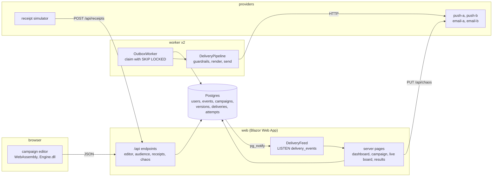
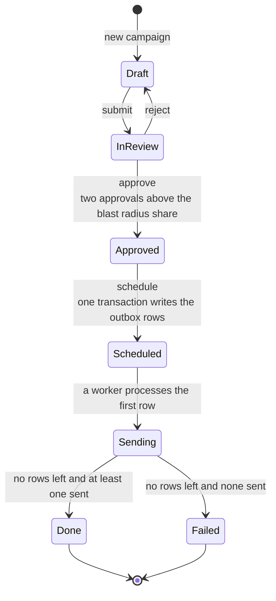
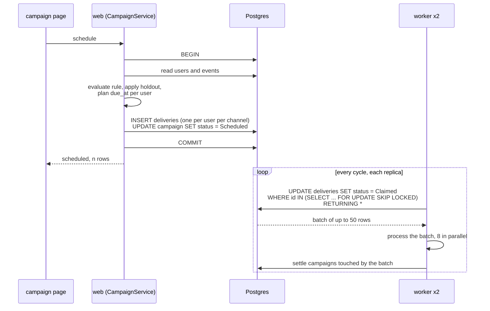
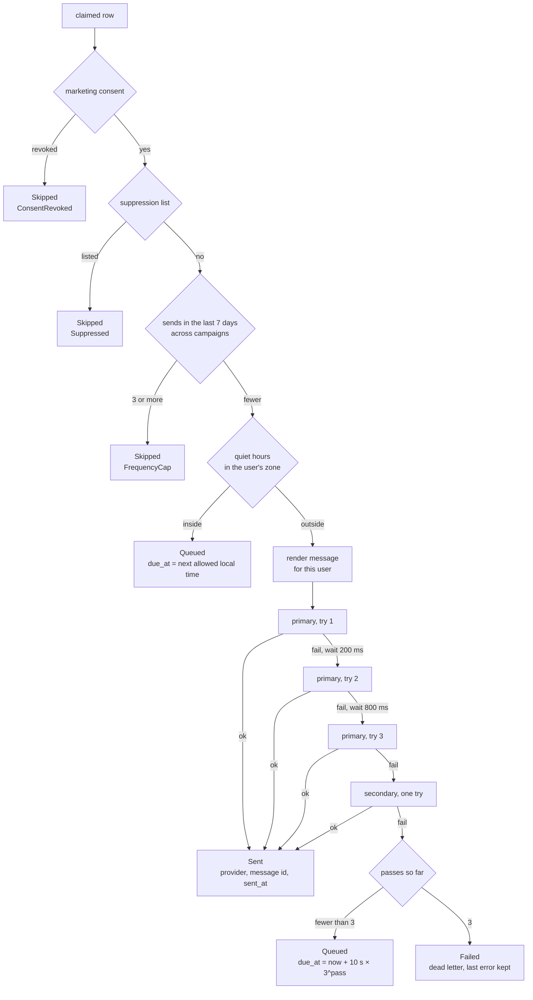
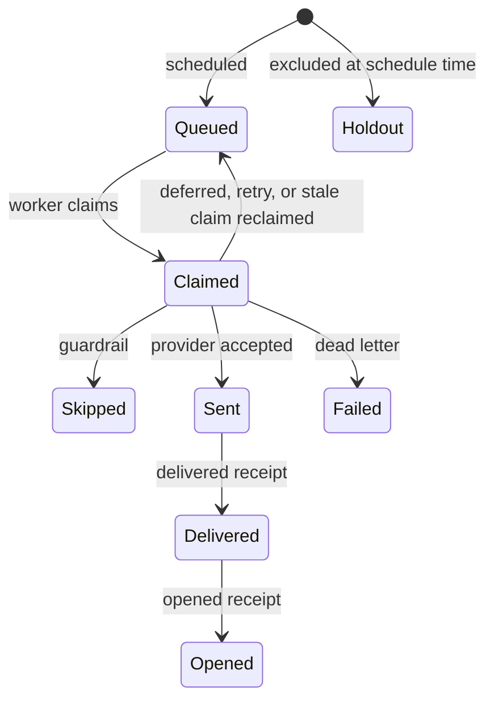
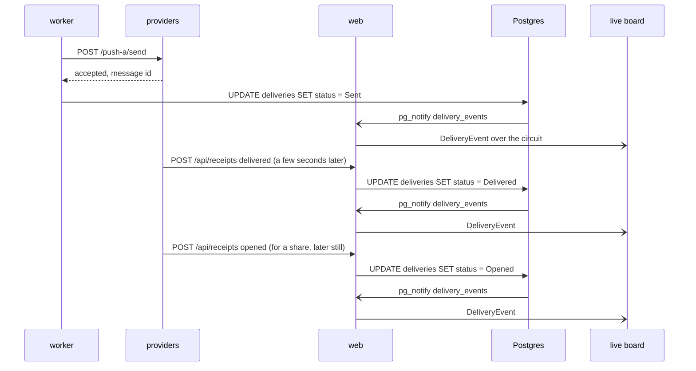
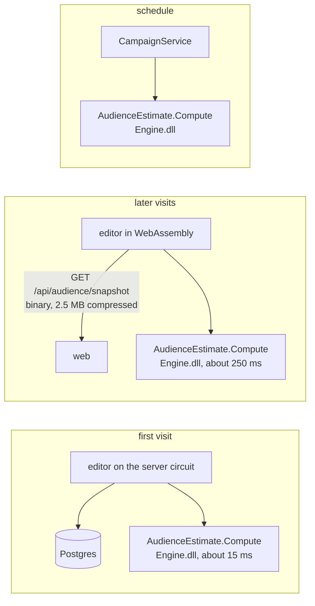

# Architecture

Five processes under one Aspire AppHost, one shared engine assembly, one Postgres database.

## Projects

| Project | Role |
|---|---|
| `OutreachStudio.Engine` | Rule tree, evaluator, audience estimate, personalisation, quiet hours, holdout, rollout planner. No package references. Referenced by the browser, the web app and the worker. |
| `OutreachStudio.Data` | EF Core entities and `OutreachDbContext`, the migration with the `pg_notify` trigger, the synthetic user generator and the seeder. |
| `OutreachStudio.Web` | Blazor Web App server: pages, JSON endpoints, `CampaignService` with the outbox write, `AudienceCache`, `DeliveryFeed`. |
| `OutreachStudio.Web.Client` | The WebAssembly project: the campaign editor page and its components, browser implementations of the editor interfaces. |
| `OutreachStudio.Worker` | Drains the outbox. Guardrails, provider calls with retry and failover, dead letters, campaign completion, spans and metrics. |
| `OutreachStudio.Providers` | Four mock providers with chaos toggles, simulated delivered and opened receipts. |
| `OutreachStudio.ServiceDefaults` | OpenTelemetry, health checks, service discovery, HTTP resilience, shared by every service. |
| `OutreachStudio.AppHost` | Aspire composition: Postgres, web, two workers, providers. |

Tests: `OutreachStudio.Engine.Tests` (rule engine, personalisation, scheduling, synthetic data), `OutreachStudio.Worker.Tests` (Testcontainers Postgres, the exactly-once concurrency test, guardrails, failover, dead letters), `OutreachStudio.E2E` (Playwright against the AppHost).

## A campaign, end to end

1. The dashboard creates a draft. Version 1 has an empty rule that matches everyone, an empty message and a default schedule.
2. The editor loads the campaign and the audience snapshot. In the browser the snapshot is one download of every user with their event timestamps. Every edit of the rule tree re-runs `AudienceEstimate.Compute` in WebAssembly and updates the count, the sample, the breakdowns and the blast radius warning. The match explanation for a sampled user is `RuleEvaluator.Explain`.
3. Saving writes a new immutable `CampaignVersion`. The campaign page diffs any two versions.
4. Submit moves the campaign to InReview. A reviewer approves. Above the blast radius share a second reviewer has to approve as well.
5. Schedule runs `CampaignService.ScheduleAsync`: evaluate the rule on the server with the same engine, plan a due time per user with the throttle and quiet hours, insert one delivery row per user per channel and set the campaign to Scheduled, all in one transaction (ADR-003).
6. Workers claim due rows with `FOR UPDATE SKIP LOCKED`, run the guardrails (ADR-004), render the message for the user and call the primary provider, then the secondary (ADR-005). Sent rows carry the provider's message id.
7. The providers service posts delivered and opened receipts to the web app, which moves each delivery forward and ignores repeats.
8. Every status change fires `pg_notify`. The web app's listener raises it to the live board (ADR-006). The results page reads the rows.

## Campaign states

The web app owns the transitions up to Scheduled. From there the workers own them: the first processed row moves the campaign to Sending, and the first cycle that finds no Queued or Claimed row finishes it. Several workers can settle the same campaign at once and each writes the same answer.

Every version of the campaign is immutable. Editing a draft writes version n+1, and approvals are recorded against a version number, so an edit after approval needs a new review.

## Scheduling and the outbox

Scheduling is one transaction. It evaluates the rule on the server over the same snapshot the browser used, applies the holdout, plans a due time per user from the throttle and the user's quiet hours, and inserts one `deliveries` row per user per channel. The unique index on `(campaign_id, user_id, channel)` is what makes a second message for the same user impossible, whichever code path tries to write it.

Two replicas run the same loop. `SKIP LOCKED` makes a second worker walk past rows the first one is holding instead of waiting behind them, so adding a replica adds throughput and never a duplicate. A worker that dies mid-batch leaves rows in Claimed, and every thirty seconds each worker returns claims older than the claim timeout (two minutes) to Queued.

The concurrency test in `OutreachStudio.Worker.Tests` runs six workers against one Postgres container with a fake provider that fails one call in ten, and asserts that the rows in Sent, the successful provider calls and the audience size are the same number.

## One delivery in the worker

`DeliveryPipeline.ProcessAsync` is what happens to a claimed row. The guardrails run here and not at authoring time, because consent, the suppression list and the frequency cap can all change between scheduling and sending. Every path leaves the row out of Claimed.

A pass is one trip through the four provider tries. The row keeps its attempt count, last error and next due time, so the retry state is visible on the results page without a separate table. Every provider call, successful or not, is a `delivery_attempts` row with the provider, the latency and the error. The provider health tiles on the dashboard aggregate those rows over the last fifteen minutes.

Delivery status after the send is driven by receipts:

The receipt endpoint only moves a delivery forward. A duplicate delivered receipt, or an opened receipt that arrives before the delivered one, changes nothing it should not, so there is no dedupe table.

## Receipts and the live board

The board does not poll. A trigger on `deliveries` calls `pg_notify('delivery_events', json)` on every status change except Claimed. The web app holds one connection listening on that channel and raises each payload to the board component over the Blazor Server circuit, which is already a SignalR connection.

`pg_notify` is best effort. The board seeds its counts from the database when it opens and the results page reads rows only, so a listener reconnect during a send loses nothing that matters.

Chaos goes the other way. The Providers page and the board call `PUT /api/chaos/{provider}` on the web app, which proxies to the providers service. Flipping `push-a` down while a send runs makes every push delivery take the three primary tries and land on `push-b`, which shows as attempt rows, as a different provider name on the last child span, and as the provider column on the board.

## Render modes and the audience estimate

Server pages are `InteractiveServer`. The editor is `InteractiveAuto` and depends on two interfaces, `ICampaignEditorApi` and `IAudienceSource`, registered on the server over the database and in the browser over HTTP. The first visit renders through the server circuit while the runtime downloads, later visits run in the browser. Both paths run the same `Engine.dll` (ADR-001).

The snapshot the browser downloads is a binary stream and not JSON, because the WebAssembly interpreter took twenty seconds to parse the same data as JSON and takes about 1.5 seconds for the binary (ADR-002). The chip in the editor says which side evaluated the rule and how long it took. The end to end test builds a rule in the browser, reads the count from the chip, and asserts it equals the count the server computes for the same rule over the same snapshot.

## Observability

Every service calls `AddServiceDefaults`, which wires OpenTelemetry tracing, metrics and logs to the OTLP endpoint the AppHost injects. The worker opens one span per delivery, `deliver push` or `deliver email`, with the campaign, delivery, user, channel, provider and outcome as attributes. Each provider call is a child span `send {provider}` with the try number, and the HTTP client instrumentation adds the request under it. A retry chain is one delivery span with several `send` children. Failover is the last child having a different provider name, and because the providers are a separate process the trace crosses two services.

Funnel counts are metrics next to the technical ones: `outreach.deliveries` counts every outcome tagged with status, channel, provider and reason, `outreach.provider.latency` is a histogram per provider, `outreach.outbox.claimed` counts claims. Logs carry the delivery and campaign ids as scope, so the Aspire dashboard links a log line to its trace (ADR-006).

## Data

Twenty thousand synthetic users with about twenty events each, generated from a fixed seed on first start so the same rule gives the same count on every machine. Names are syllables, emails are on example.net, there is no real or employer derived data anywhere in the repo. The seeded campaign history covers every status, one send with an email outage and one that collapsed on push.
