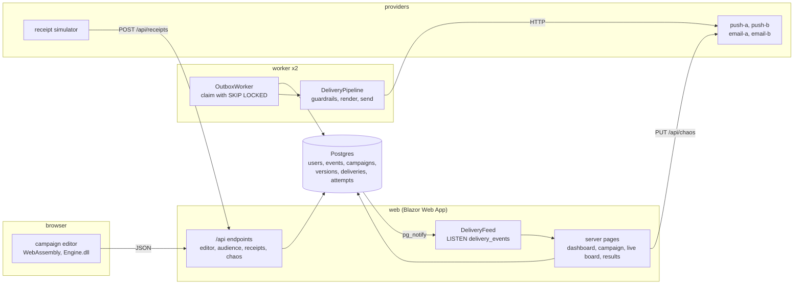

# Architecture

Five processes under one Aspire AppHost, one shared engine assembly, one Postgres database.

## Projects

| Project | Role |
|---|---|
| `OutreachStudio.Engine` | Rule tree, evaluator, audience estimate, personalisation, quiet hours, holdout, rollout planner. No package references. Referenced by the browser, the web app and the worker. |
| `OutreachStudio.Data` | EF Core entities and `OutreachDbContext`, the migration with the `pg_notify` trigger, the synthetic user generator and the seeder. |
| `OutreachStudio.Web` | Blazor Web App server: pages, JSON endpoints, `CampaignService` with the outbox write, `AudienceCache`, `DeliveryFeed`. |
| `OutreachStudio.Web.Client` | The WebAssembly project: the campaign editor page and its components, browser implementations of the editor interfaces. |
| `OutreachStudio.Worker` | Drains the outbox. Guardrails, provider calls with retry and failover, dead letters, campaign completion, spans and metrics. |
| `OutreachStudio.Providers` | Four mock providers with chaos toggles, simulated delivered and opened receipts. |
| `OutreachStudio.ServiceDefaults` | OpenTelemetry, health checks, service discovery, HTTP resilience, shared by every service. |
| `OutreachStudio.AppHost` | Aspire composition: Postgres, web, two workers, providers. |

Tests: `OutreachStudio.Engine.Tests` (rule engine, personalisation, scheduling, synthetic data), `OutreachStudio.Worker.Tests` (Testcontainers Postgres, the exactly-once concurrency test, guardrails, failover, dead letters), `OutreachStudio.E2E` (Playwright against the AppHost).

## A campaign, end to end

1. The dashboard creates a draft. Version 1 has an empty rule that matches everyone, an empty message and a default schedule.
2. The editor loads the campaign and the audience snapshot. In the browser the snapshot is one download of every user with their event timestamps. Every edit of the rule tree re-runs `AudienceEstimate.Compute` in WebAssembly and updates the count, the sample, the breakdowns and the blast radius warning. The match explanation for a sampled user is `RuleEvaluator.Explain`.
3. Saving writes a new immutable `CampaignVersion`. The campaign page diffs any two versions.
4. Submit moves the campaign to InReview. A reviewer approves. Above the blast radius share a second reviewer has to approve as well.
5. Schedule runs `CampaignService.ScheduleAsync`: evaluate the rule on the server with the same engine, plan a due time per user with the throttle and quiet hours, insert one delivery row per user per channel and set the campaign to Scheduled, all in one transaction (ADR-003).
6. Workers claim due rows with `FOR UPDATE SKIP LOCKED`, run the guardrails (ADR-004), render the message for the user and call the primary provider, then the secondary (ADR-005). Sent rows carry the provider's message id.
7. The providers service posts delivered and opened receipts to the web app, which moves each delivery forward and ignores repeats.
8. Every status change fires `pg_notify`. The web app's listener raises it to the live board (ADR-006). The results page reads the rows.

## Render modes

Server pages are `InteractiveServer`. The editor is `InteractiveAuto` and depends on two interfaces, `ICampaignEditorApi` and `IAudienceSource`, registered on the server over the database and in the browser over HTTP. The first visit renders through the server circuit while the runtime downloads, later visits run in the browser. Both paths run the same `Engine.dll` (ADR-001).

## Data

Twenty thousand synthetic users with about twenty events each, generated from a fixed seed on first start so the same rule gives the same count on every machine. Names are syllables, emails are on example.net, there is no real or employer derived data anywhere in the repo. The seeded campaign history covers every status, one send with an email outage and one that collapsed on push.
